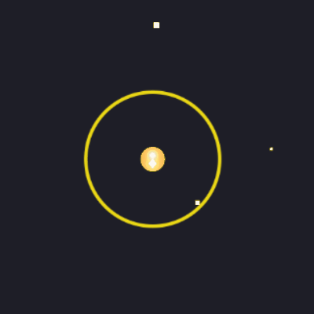
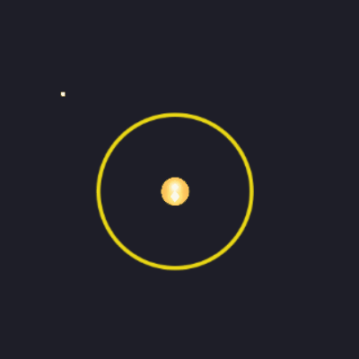

# Version 1.0
## SpaceBall
### Jeu de dextérité dans l'espace

Jeu de dexterité et de timing où le joueur doit récuperer la balle et la lancer sur son adversaire.

#### Règles
* Nombre de joueurs : 2 
* 3 vies chacun
* Récupérer la balle que lui lance son adversaire afin de lui renvoyer
* Le joueur perd une vie s'il attrape la balle sur le mauvais timing

### CONTROLES
 
Déplacement :
  * Joueur1 : Z/Q/S/D 
  * Joueur2 : O/K/L/M 

 
Reception et lancer de la balle + direction de la ball lors de la reception (joueur devient alors immobile) : 
  * Joueur1 : barre d'espace (appuyer, maintenir et relâcher) + Q/D (direction de la balle)
  * Joueur2 : touche Entrer (appuyer, maintenir et relâcher) + K/M (direction de la balle)
  
#### Technologies
* Phaser
* HTML
* JavaScript

### DATAS
* Système de deplacement
* Ramassage et lancer de la balle
* Système relatif avec la balle
* Système de vie + réinitialisation de la manche

Système manquante : 
* Une meilleur feed back pour la mort du personnage 
* un compteur de reception
* //design graphique
